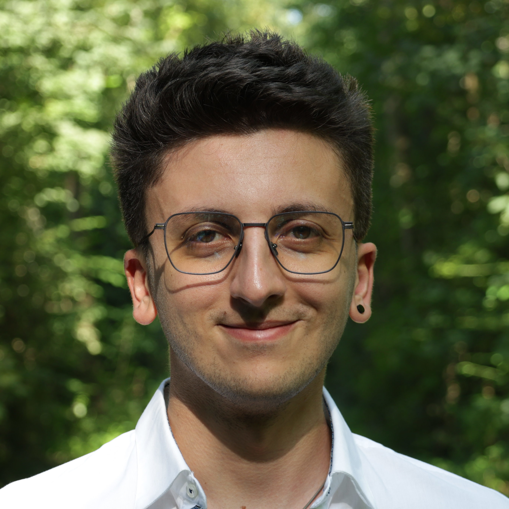

<h1>Andrea Mangione</h1>

Liks: [Website](https://andrea.mangione.dev) · [Linkedin](https://www.linkedin.com/in/andrea-mangione-592902156/)
· [GitHub](https://github.com/MangioneAndrea) | Email: [andrea@mangione.dev](mailto:andrea@mangione.dev)

<h2>Short description</h2>
<blockquote>
The Performance Guy, I'm a Linux poweruser, use Nvim for pretty much everything (even this CV) and love challanges
</blockquote>

<h2>Work experience</h2>
<table>
  <tr>
    <td>08.2024 – Now</td>
    <td>
      <b>Coop</b> – IT Business Analyst – 100% (System architecture and PO for Passabene):  
      Defining and maintaining multiple services on premise and on the cloud for reliable use and easy scaling. Ideating and discussing technical solutions for about ~ 40k scanners + mobile solutions.
    </td>
  </tr>
  <tr>
    <td>02.2022 – 07.2024</td>
    <td>
      <b>jacando AG</b> – Backend developer – 80% (MongoDB, NodeJS, ReactJS, Apollo, GCP, Docker, Go):  
      managing translations processes (CI) for multiple projects, improving noSQL db performance, code architecture, building services and containerization
    </td>
  </tr>
  <tr>
    <td>09.2020 – 02.2022</td>
    <td>
      <b>jacando AG</b> – Junior full-stack developer – 70% (MongoDB, NodeJS, ReactJS, Apollo, GCP, Docker): 
      managing translations processes (CI) for multiple projects, improving noSQL db performance, building services and containerization
    </td>
  </tr>
  <tr>
    <td>08.2019 – 08.2020</td>
    <td>
      <b>jacando AG</b> – Intern developer – 100% (MongoDB, NodeJS, ReactJS, Apollo) 
      refactoring old code to newest technologies, fullstack features implementation
    </td>
  </tr>
</table>

<h2>Studies</h2>
<table>
  <tr>
    <td>09.2020 – 07-2024</td>
    <td class="full">
      <b>FHNW</b> – BSc – Computer Sciences |
      University of Applied Sciences Northwestern Switzerland
    </td>
  </tr>
  <tr>
    <td>2016 – 2019</td>
    <td>
      <b>BBB</b> – EFZ – Computer Sciences | Berufsfachschule Baden (Vocational School)
    </td>
  </tr>
  <tr>
    <td>2016 – 2019</td>
    <td>
      <b>Kanti</b> – BM – High school graduation | Kanti Baden (Highschool)
    </td>
  </tr>
  <tr>
    <td>2015 – 2016</td>
    <td>
      German course A1–C1 (Interim year language course)
    </td>
  </tr>
  <tr>
    <td>2012 – 2015</td>
    <td>
      <b>ITIS EM (Italy)</b> – BM – High school graduation | Itis Ettore Majorana 
    </td>
  </tr>
</table>

## Skills

<h3>Programming languages and frameworks</h3>

Proficient in: Rust, Go, NodeJS, ReactJS, MongoDB  
Familiar with: Kotlin, Svelte, Java, C++, Python, SQL...

<h3>Software</h3>

Git, Docker, GCP, Nvim

### Languages (proficient)

English, German, Swiss–German, Italian

## Hobbies

Piano, Concerts, Inline-Skating, Gaming, Travelling

